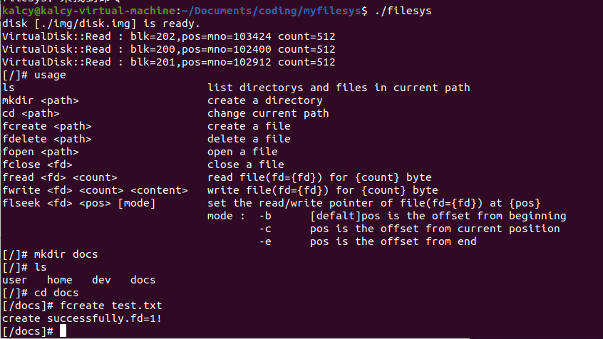

# 类UNIX二级文件系统
同济大学操作系统课程设计。本次实验完成了一个与UNIX V6++类似的二级文件存储系统。所谓二级存储系统，就是将计算机操作系统中的一个大文件(disk.img=32M)当做一个虚拟的磁盘，然后在此构建文件管理系统，具有与UNIX V6++相似的磁盘静态结构、文件管理思路等，称为二级文件系统。
这个文件系统支持单一进程访问，支持异步读写功能（具体见文档），支持windows与linux双平台编译。

# 创建虚拟磁盘文件
参考`img/Add_Disk_Image_Here.txt`
for windows：
```
fsutil file createnew disk.img 33554432
```
for linux:
```
dd if=/dev/zero of=disk.img bs=32M count=1
```

# 编译
使用CMake编译生成。
```
cd build
cmake ..
make
```
# 运行
编译完成后，运行项目根目录下的可执行文件filesys。
```
./filesys
```


# 文档资料
https://gamma.app/docs/Unix-robpcn2h4k44wwi
